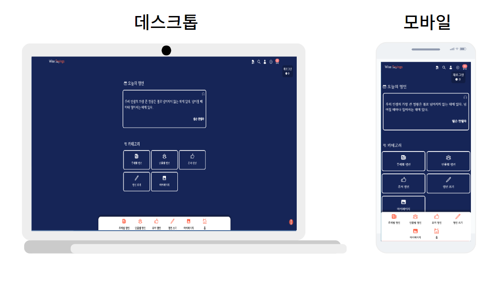

## 📓 프로젝트 명

wise sayings



## 👁‍🗨 프로젝트 개요
- 약 800개가 넘는 명언 목록을 조회하고, 자신만의 명언 카드를 커스텀하여 공유할 수 있는 차분한 앱 디자인 느낌의 웹 사이트

## 🎫 프로젝트 목적과 방향성
- [목적] 국내, 국외에도 많은 명언 웹이나 앱이 존재 합니다. 하지만, 너무 번잡하고 광범위한 정보를 다루려다 보니 마음에 드는 명언을 곱심으며 감상하기에는 사용자의 시선을 많이 분산시킵니다. 따라서 저는 마음에 드는 명언을 선택하여 차분한 마음으로 집중할 수 있는 환경을 만들고자 했습니다.
- [방향성] 해당 프로젝트는 현재 구상적인 추가적인 기능과 컨셉에 따라 전면적인 스텍 변경 및 확장이 이루어질 수 있어서 별도의 개발 기간을 명확히 해두지 않았습니다. 전체적인 틀과 초기에 계획했던 부분은 모두 구현이 끝났으나, 사용자 알림 기능, 인공지능 기반 명언 추천 기능 등등 떠오르는 기능의 틀이 명확해 지는대로 대대적인 확장이 있을 예정입니다. 필요에 따라서는 현재 사용되는 스텍을 변경하여 보다 나은 스텍으로 마이그레이션할 수 도 있습니다. 최대한 제가 어디까지 도달할 수 있는지 검증하고, 도전하기 위한 프로젝트입니다.

## 📅 개발 기간/유지보수
- (개발기간) 2023년 12월 15일 ~
- (유지보수) 2024년 1월 15일 ~

## 🔥 배포
- AWS EC2, NGINX 리버스 프록시 기반으로 구축되어 배포되었습니다. 
- 배포: [https://wise-sayings.com](https://wise-sayings.com/)

※ 이용시 참고사항(24/4/1 기준)
- 사이트 접속은 가능하나 크로스 브라우징 문제 등으로 일부 기능에 한하여 동작하지 않을 수 있습니다.
- 백엔드에서 처리하는 비밀번호 찾기 기능의 겨우 노드메일러를 사용하여 임시적으로 구현하였으나, 배포 환경에서 지메일을 제외한 도메인에서는 일부 동작하지 않는 문제를 24/4/1 에 확인하였습니다.
- 구글 로그인의 경우에는 실제 프로덕션에서 사용 시 별도의 확인 절차가 있어서 현재 콜백 URL은 로컬로 자동 지정되어 동작하지 않습니다). 또한 사용자가 이메일과 비밀번호 입력 후 엔터를 클릭하면 구글 로그인으로 이어지는 문제점이 있음을 확인하였습니다(24.04.01).
- 웹 사이트이다 보니 모바일에서 애니메이션이 동작할 때 버벅이는 렉이 발생하는 것을 확인하였습니다(예. 명언 카드의 세부 페이지 이동). 또한 요소 간에 레이아웃이 겹치는 문제로 인해 회원가입 시 터치가 인식되지 않는 문제를 확인하였습니다(24.04.01).


## 🧰 프레임워크 / 라이브러리 / 그 외 도구

### 프론트엔드/백엔드

|      사용 스텍       | 선택 이유                                                                                                                                                                                                          |
| :------------------: | :----------------------------------------------------------------------------------------------------------------------------------------------------------------------------------------------------------------- |
|    Typeccript(^5)    | (언어) 타입 안정성을 높이고, 코드 가독성 향상 이점 및 Next 팀에서 적용할 것을 권장하는 점을 참고 후 적용                                                                                                           |
|     ReactJS(^18)     | (SPA) SPA를 통해 빠른 페이지 전환으로 사용자 경험을 향상시키기 위해 적용                                                                                                                                           |
|   NextJS(^14.1.0)    | (리액트 프레임워크) SSR 기반의 RSC의 이점으로 빌드 시 SSG 를 통한 사전 로드를 통한 초기 렌더링 및 번들 사이즈 최적화를 위해 적용                                                                                   |
| Tailwindcss(^3.3.0)  | (CSS 프레임워크) 미리 스타일이 정의된 클래스를 기반으로 빠르게 CSS를 프로젝트에 적용하기 위해 적용                                                                                                                 |
|   Zustand(^4.4.7)    | (전역 상태관리) 단순한 상태의 전역 관리를 컴포넌트 단위로 쉽고, 빠르게 적용할 수 있는 이점이 있어서 활용                                                                                                           |
|     Swr(^2.2.4)      | (서버 상태관리) Tanstack Query/react에 비해 가볍고, NextJS 팀에서 개발하여 기존 프로젝트와의 호환성이나 유지보수 측면에서도 유리할 것으로 판단하였고, 실시간 데이터 처리 및 캐싱처리가 필요한 기능처리를 위해 활용 |
| React icons(^4.12.0) | 다양한 아이콘을 하나의 패키지에서 컴포넌트 형태로 쉽게 적용할 수 있는 이점으로 활용                                                                                                                                |
| React color(^2.19.3) | 다양한 형태의 컬러 선택도구를 쉽게 커스텀하여 활용할 수 있는 이점으로 선택 후 활용                                                                                                                                 |
|  Word wrap(^1.2.5)   | 기존 Canvas API 의 textRect 로 그려진 텍스트의 경우 캔버스의 크기를 벗어나더라도 자동으로 개행해주지 못하는 문제를 개선하기 위해 활용                                                                              |
|    gsap(^3.12.3)     | (애니메이션) 사용자 로그인창, 헤더 메뉴, 검색창 등 특정 사항에서의 사용자 경험 향상을 목적으로 애니메이션 기능을 적용하기 위해 사용                                                                                |

### 데이터베이스

|      사용 스텍      | 선택 이유                                                                                                                                                              |
| :-----------------: | :--------------------------------------------------------------------------------------------------------------------------------------------------------------------- |
|   SQLite(^5.1.6)    | (임시 데이터베이스) 데이터베이스 서버 없이 CRUD 처리를 간편하게 할 수 있는 점, 향후 실제 운영 시 다른 데이터베이스로 마이그레이션하기 쉬운 점이 매력적으로 보여서 선택 |
| Postgresql(^8.11.3) | (상용 데이터베이스)                                                                                                                                                    |

### 유효성 검사

|   사용 스텍   | 선택 이유                                                                                                                                                                                                                 |
| :-----------: | :------------------------------------------------------------------------------------------------------------------------------------------------------------------------------------------------------------------------ |
| Joi(^17.11.0) | (유효성) 회원가입 시 서버에서 전달받은 객체의 유효성 검사를 위해 활용(zod 와 비교 했을 때, 정적 타입 체크를 해주지 않아서 타입안정성이 떨어질 수 있다는 생각이 들었으나, 복잡한 유효성 검사가 목적이 아니므로 joi를 선택) |

### 그 외 도구

|      사용 스텍       | 선택 이유                                                                                                                                              |
| :------------------: | :----------------------------------------------------------------------------------------------------------------------------------------------------- |
|    Bcrypt(^5.1.1)    | (패스워드 암호화) bcrypt 해시 암호화 라이브러리로 회원가입 시 패스워드 암호화를 위해 사용                                                              |
| jsonwebtoken(^9.0.2) | (JWT 토큰 발급) AccessToken 기반 로그인 기능 구현을 위해 사용(향후 데이터베이스 변경 및 암호화 라이브러리로 Next-auth 으로 넘어갈 시 빠질 가능성 있음) |
|       Postman        | (API 관리 및 테스트) 서버단에서 REST API 테스트 및 api 문서화를 위한 용도로 사용                                                                       |

※ 그 외 필요한 스텍은 향후 개발 방향성에 따라서 추가될 수 있습니다.

## ⚙ 구현된 기능

- (정리본①) https://duklook.tistory.com/421

- (정리본②) https://duklook.tistory.com/427

- (정리본③) https://duklook.tistory.com/439

## 🚬트러블 슈팅(이슈)

- (트러블 슈팅①) https://duklook.tistory.com/417
- (트러블 슈팅②) https://duklook.tistory.com/432

## 프로젝트 구조(참고용)

```
📦src
 ┣ 📂app
 ┃ ┣ 📂(gallery) -----------→ 커스텀 명언 카드 갤러리(준비중)
 ┃ ┃ ┗ 📂gallery
 ┃ ┣ 📂(post) --------------→ 포스트 수정 및 업데이트 페이지 그룹
 ┃ ┃ ┣ 📂add-wisesaying
 ┃ ┃ ┗ 📂update-wisesaying
 ┃ ┣ 📂(quotes) ------------→ 명언 관련 페이지 그룹
 ┃ ┃ ┃ 📂search
 ┃ ┃ ┣ 📂quotes
 ┃ ┃ ┃ ┗ 📂[category]
 ┃ ┃ ┃   ┗ 📂[name]
 ┃ ┃ ┃     ┣ 📂[id]
 ┃ ┃ ┗ 📂user-quotes
 ┃ ┃   ┗📂[category]
 ┃ ┣ 📂(user) -------------→ 유저 관련 페이지 그룹
 ┃ ┃ ┣ 📂forgot
 ┃ ┃ ┣ 📂login
 ┃ ┃ ┣ 📂logout
 ┃ ┃ ┣ 📂mypage
 ┃ ┃ ┗ 📂signin
 ┃ ┣ 📂api ----------------→ API Routes
 ┃ ┃ ┣ 📂auth -- 인증
 ┃ ┃ ┃ ┣ 📂access
 ┃ ┃ ┃ ┣ 📂refresh
 ┃ ┃ ┃ ┣ 📂clear-token
 ┃ ┃ ┃ ┣ 📂forgot
 ┃ ┃ ┃ ┣ 📂login
 ┃ ┃ ┃ ┗ 📂signin
 ┃ ┃ ┣ 📂bookmark -- 북마크
 ┃ ┃ ┃ ┗ 📂[id]
 ┃ ┃ ┣ 📂quotes -- 명언
 ┃ ┃ ┃ ┣ 📂authors
 ┃ ┃ ┃ ┃ ┗ 📂[category]
 ┃ ┃ ┃ ┣ 📂random
 ┃ ┃ ┃ ┣ 📂search
 ┃ ┃ ┃ ┣ 📂topics
 ┃ ┃ ┃ ┃ ┗ 📂[category]
 ┃ ┃ ┃ ┣ 📂users
 ┃ ┃ ┃ ┃ ┗ 📂post
 ┃ ┃ ┃ ┃   ┣ 📂categories
 ┃ ┃ ┃ ┃   ┃ ┣ 📂[category]
 ┃ ┃ ┃ ┃   ┣ 📂[id]
 ┃ ┃ ┃ ┗ 📂[id]
 ┃ ┃ ┃   ┗ 📂comments
 ┃ ┃ ┃   ┃ ┗ 📂reply
 ┃ ┃ ┃   ┗ 📂likes
 ┃ ┃ ┣ 📂sitemap
 ┃ ┃ ┗ 📂users
 ┃ ┃   ┗ 📂mypage
 ┃ ┃     ┣ 📂posts
 ┃ ┃     ┗ 📂upload
 ┃ ┗ 📂quotes-styler
 ┃   ┗ 📂[name]
 ┃     ┗ 📂[id]
 ┣ 📂components -------------→  컴포넌트들
 ┃ ┣ 📂layout
 ┃ ┗ 📂UI
 ┃   ┣ 📂auth
 ┃   ┣ 📂bookmark
 ┃   ┣ 📂comment
 ┃   ┣ 📂common
 ┃   ┣ 📂detail-quote
 ┃   ┣ 📂header
 ┃   ┣ 📂mypage
 ┃   ┣ 📂quote
 ┃   ┣ 📂quote-editor
 ┃   ┣ 📂reply
 ┃   ┣ 📂search
 ┃   ┗ 📂styler
 ┣ 📂configs ----------------→ 프로젝트 환경 설정 관련 처리
 ┣ 📂custom -----------------→ 커스텀 훅
 ┣ 📂services ---------------→ 클라이언트 측 서비스 로직 처리
 ┃ ┣ 📂data
 ┃ ┗ 📂user
 ┣ 📂store ------------------→ Zustand 상태관리
 ┣ 📂types ------------------→ 타입 관리
 ┣ 📂utils ------------------→ 공통 함수 관리
 ┗ 📂validation -------------→ joi 유효성 검사
```
